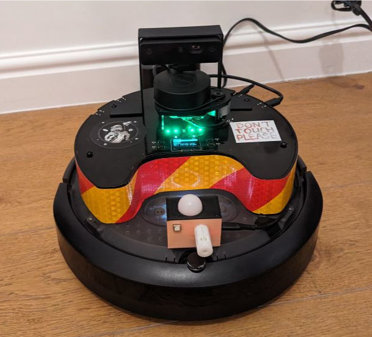
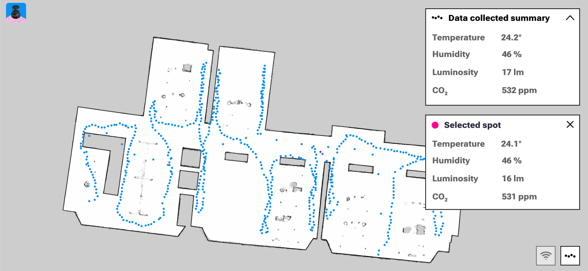
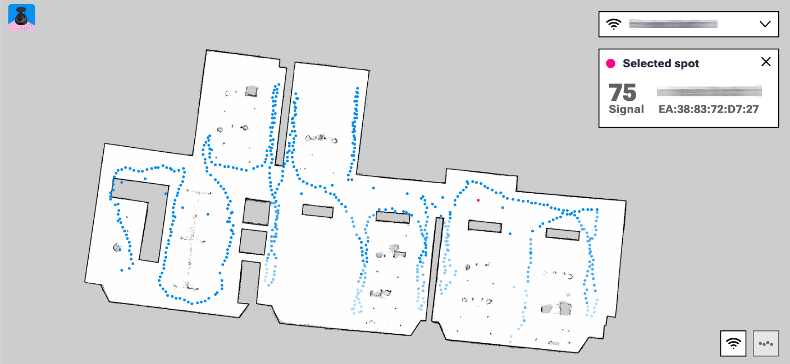

<a name="readme-top"></a>

<!-- PROJECT SHIELDS -->
[![Contributors][contributors-shield]][contributors-url]
[![Forks][forks-shield]][forks-url]
[![Stargazers][stars-shield]][stars-url]
[![Issues][issues-shield]][issues-url]
[![Apache-2.0 License][license-shield]][license-url]


<!-- PROJECT TITLE -->
<br />
<div align="center">
<h3 align="center">Data Harvester</h3>

<p align="center">
A ROS 2-based TurtleBot 4 software stack for autonomous indoor data harvesting: mapping, robot telemetry, air-quality sensing, Wi-Fi scanning, and Robonomics/IPFS publication.
</p>
</div>

<!-- TABLE OF CONTENTS -->
<details>
  <summary>Table of Contents</summary>
  <ol>
    <li>
      <a href="#about-project">About Project</a>
      <ul>
        <li><a href="#project-structure">Project Structure</a></li>
        <li><a href="#project-architecture">Project Architecture</a></li>
      </ul>
    </li>
    <li>
      <a href="#getting-started">Getting Started</a>
      <ul>
        <li><a href="#prerequisites">Prerequisites</a></li>
        <li><a href="#installation-and-building">Installation and Building</a></li>
        <li><a href="#esp32-firmware-installation">ESP32 Firmware Installation</a></li>
        <li><a href="#configuration">Configuration</a></li>
      </ul>
    </li>
    <li>
      <a href="#usage">Usage</a>
      <ul>
        <li><a href="#perception-stack">Perception Stack</a></li>
        <li><a href="#scenario-a-wall-follow-mode">Scenario A: Wall-Follow Mode</a></li>
        <li><a href="#scenario-b-chronicler-mode">Scenario B: Chronicler Mode</a></li>
        <li><a href="#using-systemd-services">Using Systemd Services</a></li>
      </ul>
    </li>
    <li><a href="#ui-for-data-visualization">UI for Data Visualization</a></li>
    <li><a href="#troubleshooting">Troubleshooting</a></li>
    <li><a href="#license">License</a></li>
    <li><a href="#media-about-project">Media About Project</a></li>
    <li><a href="#contact">Contact</a></li>
    <li><a href="#acknowledgments">Acknowledgments</a></li>
  </ol>
</details>

<!-- ABOUT THE PROJECT -->
## About Project

Data Harvester is a modular ROS 2 project that turns TurtleBot 4 into a mobile indoor sensing platform. It combines autonomous robot motion, sensor fusion, and data packaging so a single mission can produce an archive of machine-readable environmental data.



The goal of the project is to provide reproducible and secure room-state analytics based on synchronized robot, external sensor, and wireless-network measurements.

Available features include:

* Wall-follow mission with automatic undocking, SLAM map saving, odometry recording, and video capture
* Navigation-mode stack (localization + Nav2) for running missions on pre-built maps
* ESP32-based external air sensor integration (temperature, humidity, luminosity, CO2)
* Periodic Wi-Fi scanning with BSSID/SSID/channel/rate/signal export
* Data chronicling into timestamped `harvested-data-*.zip` archives
* Robonomics integration to publish resulting archives via IPFS and Robonomics parachain

<p align="right">(<a href="#readme-top">back to top</a>)</p>

### Project Structure

For convenience, the project is divided into several packages:

    .
    ├── data_harvester_chronicler   # Mission data recorder and archive publisher integration                    
    ├── data_harvester_interfaces   # Custom ROS 2 message definitions for ESP and Wi-Fi data
    ├── data_harvester_navigation   # Navigation-mode package for localization and Nav2-based movement
    ├── data_harvester_perception   # Perception package for external sensors and wireless environment scan
    ├── data_harvester_wall_follow  # End-to-end wall-follow harvesting mission package
    ├── esp32-sensors               # ESP-IDF firmware workspace for external air-sensor controller
    └── ...

<p align="right">(<a href="#readme-top">back to top</a>)</p>

### Project Architecture

Core layers:

* **Perception layer (`data_harvester_perception`)**
  Reads external environment data and publishes it as ROS 2 streams:
  * `esp32_sensors_node` parses JSON frames from ESP32 serial and publishes sensor readings (`temperature`, `humidity`, `luminosity`, `co2`).
  * `wifi_scanner_node` periodically scans nearby Wi-Fi networks and publishes scan results.

* **Navigation and mission-execution layer (`data_harvester_navigation`, `data_harvester_wall_follow`)**
  Provides robot motion strategies:
  * `data_harvester_navigation` runs map-based localization and Nav2 navigation.
  * `data_harvester_wall_follow` runs a full autonomous mission flow (undocking, wall following, mission timing, and artifact generation).

* **Data chronicling and publication layer (`data_harvester_chronicler`)**
  Collects synchronized mission data and prepares result archives:
  * `data_harvester_chronicler` (lifecycle node) records robot/perception streams into mission datasets.
  * `data_harvester_robonomics` publishes produced archives through the Robonomics/IPFS stack.

* **Interface contract layer (`data_harvester_interfaces`)**
  Defines custom message types used between packages (ESP and Wi-Fi data), so all producer/consumer nodes share a stable schema.

Data flow (high level):

1. Perception nodes publish external measurements.
2. Robot state/navigation topics are produced by TurtleBot/Nav2 stack.
3. Chronicler subscribes to both robot and perception streams, aligns them by time, and writes mission artifacts.
4. Produced archives are sent to Robonomics/IPFS by publication components.

Two operating scenarios are built on top of this architecture:

* **Scenario A: Wall-Follow mode (end-to-end)**
  Use `data_harvester_wall_follow` as the main orchestrator for a simpler autonomous run. This path is optimized for quick deployment when one launch sequence should execute the full harvesting mission.

* **Scenario B: Chronicler mode (map-based, staged)**
  Build/save a map with SLAM, run localization + navigation on that map, start chronicler lifecycle collection, and publish outputs through Robonomics/IPFS. This path is better when you need explicit control over mapping, navigation, and publication stages.

<p align="right">(<a href="#readme-top">back to top</a>)</p>
<!-- GETTING STARTED -->

## Getting Started

### Prerequisites

Make sure the following base components are installed and available before running Data Harvester:

* Linux OS distribution (tested on [Ubuntu 22.04.4](https://releases.ubuntu.com/jammy/))
* ROS 2 distribution (tested on [Humble](https://docs.ros.org/en/humble/Installation.html))
* [Python 3](https://www.python.org/downloads/) (tested on 3.10.12)
* [TurtleBot 4](https://turtlebot.github.io/turtlebot4-user-manual/) software stack (including `turtlebot4_navigation`)
* `nmcli` (NetworkManager CLI) for Wi-Fi scanning
* [Robonomics ROS 2 Wrapper 3.1.0](https://github.com/airalab/robonomics-ros2) packages (required for the chronicler/publication pipeline)

<p align="right">(<a href="#readme-top">back to top</a>)</p>

### Installation and Building

1. Complete the manufacturer baseline setup for TurtleBot 4.
   Official guide: https://turtlebot.github.io/turtlebot4-user-manual/setup/basic.html

2. Apply the baseline network and middleware settings used by this project:
   * Connect to the robot Raspberry Pi access point and run `turtlebot4-setup`.
   * Configure Wi-Fi credentials for your local network.
   * Update packages on the robot (`apt upgrade`).
   * In ROS 2 settings, use Fast DDS (`rmw_fastrtps_cpp`) and configure Discovery Server.
   * In Create 3 web UI, verify Fast DDS, Domain ID, namespace, and Discovery Server settings match Raspberry Pi.
   * From your workstation, verify topic visibility with `ros2 topic list`.

3. Create a ROS 2 workspace on the robot:
    ```shell
    mkdir -p your_project_ws/src
    cd your_project_ws/src
    ```

4. Clone this repository:
    ```shell
    git clone https://github.com/Fingerling42/data-harvester.git
    ```

5. Build from the workspace root:
    ```shell
    cd ../
    colcon build
    ```

6. Source the workspace in every new terminal:
    ```shell
    source install/setup.bash
    ```

### ESP32 Firmware Installation

ESP32 sensing context in this project:
* ESP32 with sensors connects to TurtleBot via USB.
* Firmware publishes JSON frames over serial.
* A special node reads these frames and publishes ROS 2 messages on `data_harvester/esp_sensors` topic.
* Supported sensors are:
  * temperature and humidity (SHT3x)
  * luminosity/light level (BH1750)
  * CO2 concentration (SCD4x)

To build and flash ESP32 firmware (`esp32-sensors/`) you can use ESP-IDF.
Official ESP-IDF setup guide: https://docs.espressif.com/projects/esp-idf/en/stable/esp32/get-started/

Firmware variants:
* `esp32-sensors/data_harvester_esp_offline` — sensor streaming over serial without Wi-Fi.
* `esp32-sensors/data_harvester_esp_online` — sensor streaming with Wi-Fi enabled.

Typical flashing command inside the selected firmware directory:
```shell
idf.py build flash monitor
```

<p align="right">(<a href="#readme-top">back to top</a>)</p>

### Configuration

1. To configure ESP32 serial settings for the perception node, open `data_harvester_perception/config/esp_config.yaml` and change:
    * `esp_port`: serial device path (for example `/dev/serial/by-id/...`)
    * `esp_baudrate`: baud rate (default in repo: `115200`)

2. To configure wall-follow mode parameters, open `data_harvester_wall_follow/config/harvester_config.yaml` and change:
    * `runtime_min`: mission duration in minutes
    * `map_name`: output map basename for SLAM artifacts

3. If using chronicler mode, review map/localization/nav2 parameters:
    * `data_harvester_navigation/config/turtlebot4_localization.yaml`
    * `data_harvester_navigation/config/turtlebot4_nav2.yaml`

4. If using chronicler mode, provide a valid `pubsub_params_path` when launching chronicler.
   The chronicler requests `ipfs_dir_path` from `robonomics_ros2_pubsub` and writes archives there.

<p align="right">(<a href="#readme-top">back to top</a>)</p>

<!-- USAGE EXAMPLES -->
## Usage

Data Harvester is typically used in two runtime scenarios, both relying on the same perception stack.

### Perception Stack

Start perception once to publish external sensor and Wi-Fi data:

```shell
ros2 launch data_harvester_perception perception_launch.py
```

This launches:
* ESP32 sensor reader (`esp32_sensors_node`)
* Wi-Fi scanner (`wifi_scanner_node`)

### Scenario A: Wall-Follow Mode

1. Start perception stack (command above).
2. Start wall-follow mission:

```shell
ros2 launch data_harvester_wall_follow data_harvester_wall_follow_launch.py
```

Artifacts produced by this scenario:
* `harvested-data-<timestamp>.zip` in workspace root.
* Inside the archive:
  * `harvesting_process.mp4` (OAK-D preview video).
  * `odom.json` (time-stamped robot state stream: SLAM pose, mouse odometry, IMU, cliff IR, bumper IR).
  * `esp_sensors.json` (time-stamped ESP readings with SLAM pose context: temperature, humidity, luminosity, CO2).
  * `<map_name>.yaml` and `<map_name>.pgm` (occupancy map from `slam_toolbox/save_map`).
  * `<map_name>.posegraph` and `<map_name>.data` (serialized SLAM graph from `slam_toolbox/serialize_map`).

`<map_name>` is taken from `data_harvester_wall_follow/config/harvester_config.yaml`.

### Scenario B: Chronicler Mode

1. Build a map with SLAM:

```shell
ros2 launch turtlebot4_navigation slam.launch.py sync:=false params:=./turtlebot4_slam.yaml
```

2. Save occupancy map:

```shell
ros2 service call /slam_toolbox/save_map slam_toolbox/srv/SaveMap "name:
  data: 'room_map'"
```

3. Serialize SLAM pose graph:

```shell
ros2 service call /slam_toolbox/serialize_map slam_toolbox/srv/SerializePoseGraph "{filename: 'room_map'}"
```

4. Start perception stack (command from perception section).

5. Start navigation on the saved map:

```shell
ros2 launch data_harvester_navigation data_harvester_navigation_launch.py map:=./room/room_map.yaml
```

6. Start chronicler with Robonomics/IPFS parameters:

```shell
ros2 launch data_harvester_chronicler data_harvester_chronicler_launch.py pubsub_params_path:=dh_robonomics_params.yaml
```

7. Configure the chronicler lifecycle node:

```shell
ros2 lifecycle set /data_harvester_chronicler configure
```

Artifacts produced by this scenario:
* Mapping stage outputs (from steps 2-3):
  * `room_map.yaml`, `room_map.pgm`, `room_map.posegraph`, `room_map.data`.
* Chronicler outputs in `ipfs_dir_path` (received from `robonomics_ros2_pubsub` params):
  * `data.json` (synchronized robot + ESP dataset: pose, ESP air sensors, mouse, IMU, cliff IR, bumper IR).
  * `wifi_list.json` (time-stamped Wi-Fi scan dataset with robot pose and per-BSSID signal/SSID entries).
  * `harvested-data-<timestamp>.zip` containing `data.json` and `wifi_list.json`.
* Publication handoff:
  * Chronicler publishes archive filename to `data_harvester/archive_name`.
  * `data_harvester_robonomics` sends the archive through Robonomics/IPFS datalog flow.

### Using Systemd Services

For persistent deployments, use the provided service files:

* `data_harvester_perception/systemd/data-harvester-perception.service` - auto-starts perception stack.
* `data_harvester_chronicler/systemd/ipfs-daemon.service` - auto-starts local IPFS daemon used by Robonomics flow.

Typical setup:

1. Copy the required `.service` file(s) to `/etc/systemd/system/`.
2. Run `sudo systemctl daemon-reload`.
3. Enable at boot: `sudo systemctl enable <service-name>`.
4. Start now: `sudo systemctl start <service-name>`.
5. Inspect status/logs:
   * `systemctl status <service-name>`
   * `journalctl -u <service-name> -f`

<p align="right">(<a href="#readme-top">back to top</a>)</p>

## UI for Data Visualization

For interactive exploration of harvested mission data, the project uses the external frontend [`airalab/data-harvester-dapp`](https://github.com/airalab/data-harvester-dapp). 

It is a Vue 3 + Vite web application designed to present TurtleBot 4 datasets in a user-friendly format and support the Robonomics/IPFS data flow used by this project. In practice, it acts as the visualization layer on top of generated Data Harvester archives, so operators can review collected telemetry and environment measurements without working directly with raw JSON files.





## Troubleshooting

### 1) High CPU/load from diagnostics nodes

* Open `turtlebot4-setup` on Raspberry Pi.
* In ROS settings, disable diagnostics nodes.

### 2) Unstable DDS performance / high latency

* Use Fast DDS (`rmw_fastrtps_cpp`) and Discovery Server in `turtlebot4-setup`.
* Ensure Create 3 (in web UI) and Raspberry Pi use matching DDS settings (middleware, Domain ID, namespace, discovery mode).
* Optional advanced tuning: adjust Fast DDS fragment cache/memory parameters for your network and traffic profile.

### 3) Time desynchronization between PC, Raspberry Pi, and Create 3

1. Check `chrony` config on PC and Raspberry Pi:
```shell
cat /etc/chrony/chrony.conf
```
2. Open Create 3 web UI and go to `Edit ntp.conf`.
3. Set NTP server (example from setup notes):
```conf
# Use RPi4 as preferred server
# Minpoll 2^4 = 16s
# Maxpoll 2^6 = 64s
server 192.168.186.3 prefer iburst minpoll 4 maxpoll 6
```
4. Restart NTPD from Create 3 web UI.

### 4) RPLIDAR disconnects after connecting additional USB serial devices

Symptom: `/dev/RPLIDAR` can bind to the wrong USB adapter.

Cause: The default udev rule is too generic for similar USB-UART devices.

Fix:
1. Edit TurtleBot 4 udev rules:
```shell
sudo nano /etc/udev/rules.d/50-turtlebot4.rules
```
2. Use a rule that matches your actual lidar USB serial number (replace values for your hardware in `ATTRS{serial}`).
3. Reload udev rules:
```shell
sudo udevadm control --reload-rules
sudo udevadm trigger
```

### 5) Random lidar dropouts or lidar motor behavior issues

Symptom: Lidar node can fail intermittently or behave incorrectly.

Fix:
1. Edit:
```shell
sudo nano /opt/ros/humble/share/turtlebot4_bringup/launch/rplidar.launch.py
```
2. Ensure `rplidar_node` uses the expected parameters, including:
   * `serial_port: /dev/RPLIDAR`
   * `serial_baudrate: 115200`
   * `frame_id: rplidar_link`
   * `auto_standby: False`
3. Restart TurtleBot 4 service:
```shell
sudo systemctl restart turtlebot4.service
```

Note: Changes under `/opt/ros/...` can be overwritten after package updates.

### 6) Nav2 localization/navigation scan topic mismatch

Symptom: Navigation fails or local/global costmaps do not update correctly.

Fix:
1. In localization config:
```shell
sudo nano /opt/ros/humble/share/turtlebot4_navigation/config/localization.yaml
```
   Set:
```yaml
amcl:
  ros__parameters:
...
    scan_topic: /scan
...
```

2. In Nav2 config:
```shell
sudo nano /opt/ros/humble/share/turtlebot4_navigation/config/nav2.yaml
```
   Set scan topic to `/scan` for local and global costmaps.

### 7) Periodic OAK-D camera communication error (`X_LINK_ERROR`)

Symptom: Camera occasionally fails with stream read errors.

Fix options:
* Use separate power delivery (instead of sharing power and data over one cable).
* Connect through stable USB-C side ports on the robot.

### 8) OAK-D video quality is too low by default

Symptom: Video topic uses low-bandwidth preview settings.

Fix:
1. Edit OAK-D config:
```shell
sudo nano /opt/ros/humble/share/turtlebot4_bringup/config/oakd_pro.yaml
```
2. Review and adjust key parameters in:
```yaml
/oakd:
  ros__parameters:
    camera:
      ...
    rgb:
      i_max_q_size:     # Video message queue size
      i_enable_preview: # Enabling preview
      i_preview_size:   # Preview resolution
      i_low_bandwidth:  # Enabling lower quality mode (for poor network)
      i_publish_topic:  # Parameter that enables and disables topics
      i_resolution:     # The resolution of this camera cannot be made lower than 1080P
      ...
```

Use higher quality only if DDS/network/CPU load is acceptable for your deployment.

<p align="right">(<a href="#readme-top">back to top</a>)</p>

## License

Distributed under the Apache-2.0 License. See `LICENSE` for more information.

<p align="right">(<a href="#readme-top">back to top</a>)</p>

<!-- MEDIA -->
## Media About Project

* Project report article: [Data Harvester report (April 2024)](https://robonomics.network/blog/data-harvester-report-april-2024/)
* Twitter/X thread: [@berman_ivan Data Harvester thread](https://x.com/berman_ivan/status/1759943496742404346)

<p align="right">(<a href="#readme-top">back to top</a>)</p>

<!-- CONTACT -->
## Contact

Ivan Berman - [@berman_ivan](https://twitter.com/berman_ivan) - fingerling42@proton.me

<p align="right">(<a href="#readme-top">back to top</a>)</p>

<!-- ACKNOWLEDGMENTS -->
## Acknowledgments

* [Best-README-Template](https://github.com/othneildrew/Best-README-Template/)

<p align="right">(<a href="#readme-top">back to top</a>)</p>

<!-- MARKDOWN LINKS & IMAGES -->
<!-- https://www.markdownguide.org/basic-syntax/#reference-style-links -->
[contributors-shield]: https://img.shields.io/github/contributors/Fingerling42/data-harvester.svg?style=for-the-badge
[contributors-url]: https://github.com/Fingerling42/data-harvester/graphs/contributors
[forks-shield]: https://img.shields.io/github/forks/Fingerling42/data-harvester.svg?style=for-the-badge
[forks-url]: https://github.com/Fingerling42/data-harvester/network/members
[stars-shield]: https://img.shields.io/github/stars/Fingerling42/data-harvester.svg?style=for-the-badge
[stars-url]: https://github.com/Fingerling42/data-harvester/stargazers
[issues-shield]: https://img.shields.io/github/issues/Fingerling42/data-harvester.svg?style=for-the-badge
[issues-url]: https://github.com/Fingerling42/data-harvester/issues
[license-shield]: https://img.shields.io/github/license/Fingerling42/data-harvester.svg?style=for-the-badge
[license-url]: https://github.com/Fingerling42/data-harvester/blob/humble/LICENSE
